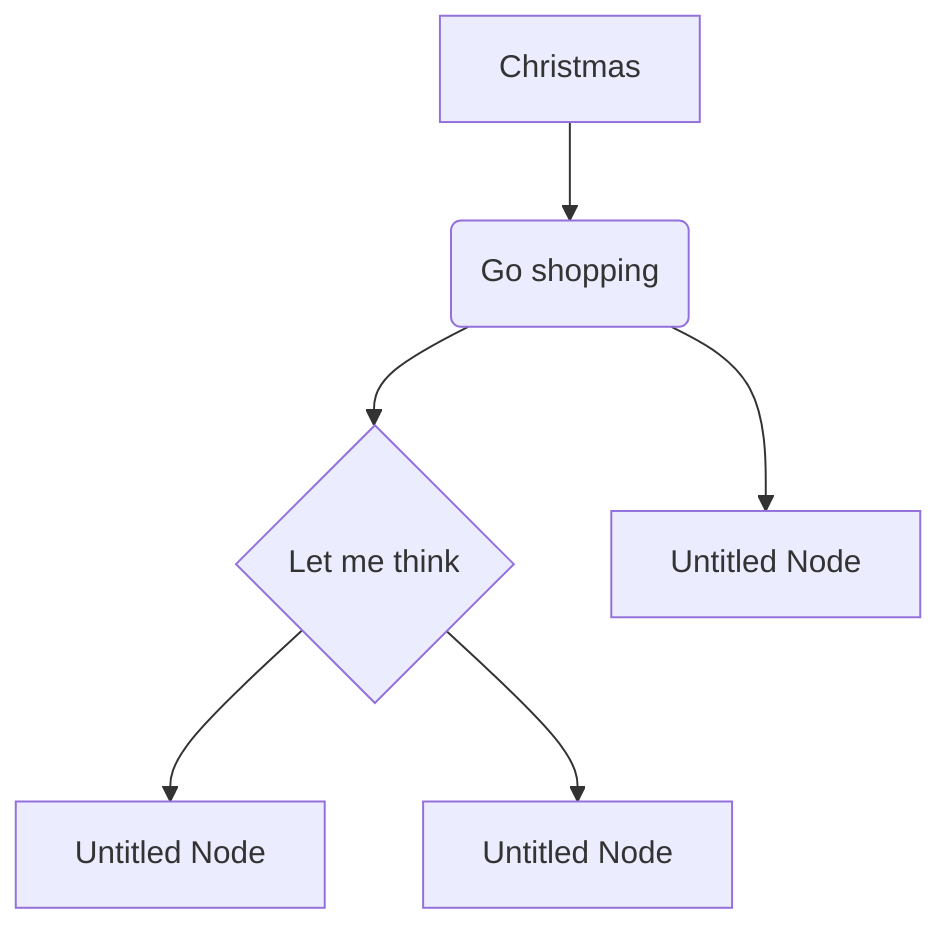

## Hes He

<!-- more -->


<!-- @include: ./contact_me.md -->


::: tip
This is a tip
:::

::: warning
This is a warning
:::

::: danger
This is a dangerous warning
:::

::: info
This is an information.
:::

::: important
This is an important message
:::

::: note
This is a note
:::

::: details
This is a details block
:::


::: code-tabs

@tab JavaScript

```js
const name = 'VuePress'
console.log(`Hello, ${name}!`)
```

@tab TypeScript

```ts
const name: string = 'VuePress'

console.log(`Hello, ${name}!`)
```

:::


::: danger STOP
Danger zone, do not proceed
:::

::: details Click me to view the code

```ts
console.log('Hello, VuePress!')
```

:::


```ts {1,7-9}
import { defaultTheme } from '@vuepress/theme-default'
import { defineUserConfig } from 'vuepress'

export default defineUserConfig({
  title: 'Hello, VuePress',

  theme: defaultTheme({
    logo: 'https://vuejs.org/images/logo.png',
  }),
})
```


```ts:line-numbers
// line-numbers is enabled
const line2 = 'This is line 2'
const line3 = 'This is line 3'
```

```ts :no-line-numbers
// line-numbers is disabled
const line2 = 'This is line 2'
const line3 = 'This is line 3'
```

```ts :line-numbers=2
// line-numbers is enabled and start from 2
const line3 = 'This is line 3'
const line4 = 'This is line 4'
```


Install VuePress:

::: code-tabs#shell

@tab pnpm

```bash
pnpm add -D vuepress
```

@tab yarn

```bash
yarn add -D vuepress
```

@tab:active npm

```bash
npm i -D vuepress
```

:::

Install VuePress Tabs Plugin:

::: code-tabs#shell

@tab pnpm

```bash
pnpm add -D @vuepress/plugin-markdown-tab
```

@tab yarn

```bash
yarn add -D @vuepress/plugin-markdown-tab
```

@tab:active npm

```bash
npm i -D @vuepress/plugin-markdown-tab
```

:::


<ArtPlayer src="https://vp-demo.u2sb.com/video/caminandes_03_llamigos_720p.mp4" />

<BiliBili bvid="BV1kt411o7C3" />

<PDF url="//theme-hope-assets.vuejs.press/files/sample.pdf" />


<VidStack
  src="youtube/_cMxraX_5RE"
  title="VidStack YouTube Demo"
/>


<VidStack
  src="//theme-hope-assets.vuejs.press/files/sample.mp3"
  title="VidStack Audio Demo"
/>


<VidStack
  title="Agent 327 Operation Barber Shop"
  poster="https://files.vidstack.io/agent-327/poster.png"
  :src="[
    {
      src: 'https://files.vidstack.io/agent-327/720p.mp4',
      type: 'video/mp4',
    },
    {
      src:  'https://files.vidstack.io/agent-327/720p.avi',
      type: 'video/avi',
    },
    {
      src:  'https://files.vidstack.io/agent-327/720p.ogv',
      type: 'video/ogg',
    },
  ]"
  :tracks="[
    {
      src: 'https://files.vidstack.io/agent-327/subs/english.vtt',
      label: 'English',
      language: 'en-US',
      kind: 'subtitles',
      default: true,
    },
    {
      src: 'https://files.vidstack.io/agent-327/subs/spanish.vtt',
      label: 'Spanish',
      language: 'es-ES',
      kind: 'subtitles',
    },
    {
      src: 'https://files.vidstack.io/agent-327/subs/french.vtt',
      label: 'French',
      language: 'fr-FR',
      kind: 'subtitles',
    },
    {
      src: 'https://files.vidstack.io/agent-327/subs/german.vtt',
      label: 'German',
      language: 'ge-GE',
      kind: 'subtitles',
    },
    {
      src: 'https://files.vidstack.io/agent-327/subs/italian.vtt',
      label: 'Italian',
      language: 'it-IT',
      kind: 'subtitles',
    },
    {
      src: 'https://files.vidstack.io/agent-327/subs/russian.vtt',
      label: 'Russian',
      language: 'ru-RU',
      kind: 'subtitles',
    },
    // Chapters
    {
      src: 'https://files.vidstack.io/agent-327/chapters.vtt',
      kind: 'chapters',
      language: 'en-US',
      default: true,
    },
  ]"
  thumbnails="https://files.vidstack.io/agent-327/thumbnails.vtt"
/>

<Share colorful />
<!-- <Share services="qq,weibo" />
<Share :services="['qq','weibo']" />
<Share /> -->


- Home icon: <FontIcon icon="home" />

- A big and green share icon: <FontIcon icon="share" color="#3eaf7c" size="32" />

- <Badge text="tip" type="tip" vertical="middle" />
- <Badge text="warning" type="warning" vertical="middle" />
- <Badge text="danger" type="danger" vertical="middle" />
- <Badge text="important" type="important" vertical="middle" />
- <Badge text="info" type="info" vertical="middle" />
- <Badge text="note" type="note" vertical="middle" />


<VidStack
  src="https://files.vidstack.io/sprite-fight/720p.mp4"
  poster="https://files.vidstack.io/sprite-fight/poster.webp"
/>


Let $f\colon[a,b]\to\R$ be Riemann integrable. Let $F\colon[a,b]\to\R$ be
$F(x)=\int_{a}^{x} f(t)\,dt$. Then $F$ is continuous, and at all $x$ such that
$f$ is continuous at $x$, $F$ is differentiable at $x$ with $F'(x)=f(x)$.

# Welcom to my blog. 🙏

May contain some [links](./file.mdx) or **emphasis**.

<h2>Center an Image</h2>
<p>To center an image, set left and right margin to auto, and make it into a block element.</p>



:::note

Some **content** with _Markdown_ `syntax`. Check [this `api`](#).

:::

:::tip

Some **content** with _Markdown_ `syntax`. Check [this `api`](#).

:::

:::info

Some **content** with _Markdown_ `syntax`. Check [this `api`](#).

:::

:::warning

Some **content** with _Markdown_ `syntax`. Check [this `api`](#).

:::

:::danger

Some **content** with _Markdown_ `syntax`. Check [this `api`](#).

:::


$$
\sum_{i=1}^Nax_n^2
$$


- [ ] aaa
- [ ] bbb
- [ ] ccc


## Heading 2

### Heading 3
#### Heading 4
##### Heading 5
###### Heading 6

Thanks for visiting [The Markdown Guide](https://www.markdownguide.org)!

This Markdown cheat sheet provides a quick overview of all the Markdown syntax elements. It can’t cover every edge case, so if you need more information about any of these elements, refer to the reference guides for [basic syntax](https://www.markdownguide.org/basic-syntax/) and [extended syntax](https://www.markdownguide.org/extended-syntax/).

## Basic Syntax

These are the elements outlined in John Gruber’s original design document. All Markdown applications support these elements.

### Heading

# H1
## H2
### H3

### Bold

**bold text**

### Italic

*italicized text*

### Blockquote

> blockquote

### Ordered List

1. First item
2. Second item
3. Third item

### Unordered List

- First item
- Second item
- Third item

### Code

`code`

### Horizontal Rule

---

### Link

[Markdown Guide](https://www.markdownguide.org)

### Image


## Extended Syntax

These elements extend the basic syntax by adding additional features. Not all Markdown applications support these elements.

### Table

| Syntax | Description |
| ----------- | ----------- |
| Header | Title |
| Paragraph | Text |

### Fenced Code Block

```json
{
  "firstName": "John",
  "lastName": "Smith",
  "age": 25
}
```

### Footnote

Here's a sentence with a footnote. [^1]

[^1]: This is the footnote.

### Heading ID

### My Great Heading {#custom-id}

### Definition List

term
: definition

### Strikethrough

~~The world is flat.~~

### Task List

- [x] Write the press release
- [ ] Update the website
- [ ] Contact the media

### Emoji

That is so funny! :joy:

(See also [Copying and Pasting Emoji](https://www.markdownguide.org/extended-syntax/#copying-and-pasting-emoji))

### Highlight

I need to highlight these ==very important words==.

### Subscript

H~2~O

### Superscript

X^2^

